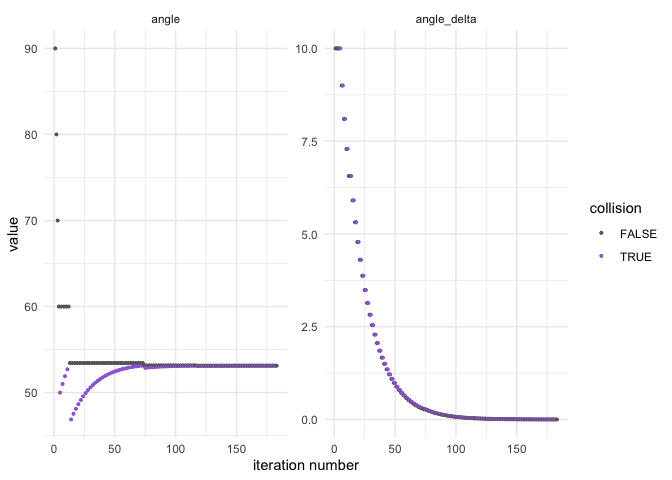
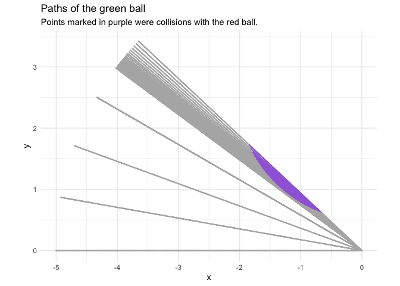
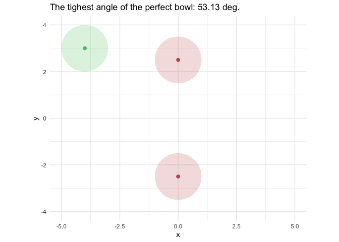

Riddler: Can You Roll The Perfect Bowl?
================
Joshua Cook
5/30/2020

## FiveThirtyEight’s Riddler Express

[link](https://fivethirtyeight.com/features/can-you-roll-the-perfect-bowl/)

> At the recent World Indoor Bowls Championships in Great Yarmouth,
> England, one of the rolls by Nick Brett went viral. Here it is in all
> its glory:

<blockquote class="twitter-tweet">

<p lang="en" dir="ltr">

12/10 on the mindblowing scale 🤯
<a href="https://twitter.com/hashtag/SCtop10?src=hash&amp;ref_src=twsrc%5Etfw">\#SCtop10</a><br><br>(via
<a href="https://twitter.com/BBCSport?ref_src=twsrc%5Etfw">@BBCSport</a>)
<a href="https://t.co/6pN6ybzVel">pic.twitter.com/6pN6ybzVel</a>

</p>

— SportsCenter (@SportsCenter)
<a href="https://twitter.com/SportsCenter/status/1220355057503363072?ref_src=twsrc%5Etfw">January
23, 2020</a>

</blockquote>

<script async src="https://platform.twitter.com/widgets.js" charset="utf-8"></script>

> In order for Nick’s green bowl to split the two red bowls, he needed
> expert precision in both the speed of the roll and its final angle of
> approach.

> Suppose you were standing in Nick’s shoes, and you wanted to split two
> of your opponent’s bowls. Let’s simplify the math a little, and say
> that each bowl is a sphere with a radius of 1. Let’s further suppose
> that your opponent’s two red bowls are separated by a distance of 3 —
> that is, the centers of the red bowls are separated by a distance of
> 5. Define phi as the angle between the path your bowl is on and the
> line connecting your opponent’s bowls.

> For example, here’s how you could split your opponent’s bowls when phi
> is 75 degrees:


> What is the minimum value of phi that will allow your bowl to split
> your opponents’ bowls without hitting them?

## Plan

I will approximate the solution to this puzzle by simulating the game
from many different angles. Thankfully, because the game is vertically
and horizontally symmetric, I only need to simulate the green ball
reaching the middle point between the red balls and only need to see if
it collides with the top red ball.

## Setup

``` r
knitr::opts_chunk$set(echo = TRUE, comment = "#>", cache = TRUE)

library(glue)
library(clisymbols)
library(ggforce)
library(gganimate)
library(tidyverse)

theme_set(theme_minimal())

green <- "#54c761"
red <- "#c75454"
purple <- "#a06bdb"
light_grey <- "grey70"
grey <- "grey40"

set.seed(0)
```

## Simulate a single pass

``` r
# Make a green ball location from the x-position and angle.
make_green_ball <- function(h, angle) {
    x <- -1 * h * cos(pi/2 - angle)
    y <- h * sin(pi/2 - angle)
    list(x = x, y = y)
}
```

``` r
# Decide wether the two balls of radius `r` collided.
did_balls_collide <- function(ball1, ball2, radius) {
    d <- sqrt((ball1$x - ball2$x)^2 + (ball1$y - ball2$y)^2)
    return(d <= 2*radius)
}
```

``` r
# Run a simulation of the bowling game.
run_bowl_simulation <- function(angle, 
                                step_size = 0.1, 
                                red_ball_loc = list(x = 0, y = 2.5)) {
    h_start <- 5
    h_vals <- seq(h_start, 0, by = -step_size)
    angle <- angle * (pi / 180)
    
    all_ball_pos <- NULL
    
    for (h in h_vals) {
        green_ball <- make_green_ball(h, angle)
        collision <- did_balls_collide(green_ball, red_ball_loc, radius = 1)
        all_ball_pos <- bind_rows(
            all_ball_pos,
            tibble(h = h, 
                   x = green_ball$x, 
                   y = green_ball$y, 
                   collision = collision)
        )
    }
    return(all_ball_pos)
}
```

``` r
map(seq(90, 0, -10), run_bowl_simulation, step_size = 0.1) %>%
    map2(seq(90, 0, -10), ~ .x %>% add_column(angle = .y)) %>%
    bind_rows() %>%
    mutate(collision = ifelse(collision, "collision", "safe")) %>%
    ggplot() +
    geom_point(aes(x, y, color = collision), size = 2) +
    geom_circle(aes(x0 = x0, y0 = y0, r = r), 
                         data = tibble(x0 = 0, y0 = 2.5, r = 1),
                         color = red, fill = red, alpha = 0.5) +
    scale_color_manual(values = c(purple, light_grey)) +
    coord_fixed() +
    theme(
        legend.position = c(0.15, 0.9),
        legend.title = element_blank()
    ) +
    labs(x = "x", y = "y", 
         title = "Example paths of the green ball",
         subtitle = "For the angles between 0 and 90 at 10 degree intervals.")
```

<!-- -->

``` r
# The starting angle.
angle <- 90
previous_angle <- angle

# The "learning rate" paramerters.
angle_delta <- 10
epsilon <- 0.8
min_angle_delta <- 0.01

collision <- TRUE

memo_bowl_sim <- memoise::memoise(run_bowl_simulation)

while (angle_delta >= min_angle_delta |collision) {
    # Run the bowling simulation with the current angle.
    sim_res <- memo_bowl_sim(angle = angle, step_size = 0.1)
    
    # Were there any collisions?
    collision <- any(sim_res$collision)
    
    # Print results
    msg <- "collision: {ifelse(collision, symbol$cross, symbol$tick)}" %>%
        paste("{collision},") %>%
        paste("angle: {round(angle, 4)},") %>%
        paste(angle_delta: {round(angle_delta, 4)})
    print(glue(msg))
    
    if (!collision) {
        # Reduce the angle if there is no collision.
        previous_angle <- angle
        angle <- angle - angle_delta
    } else {
        # Revert to the previous angle and reduce delta if there is a collision.
        angle_delta <- epsilon * angle_delta
        angle <- previous_angle
    }
}
```

    #> collision: ✔ FALSE, angle: 90, 10
    #> collision: ✔ FALSE, angle: 80, 10
    #> collision: ✔ FALSE, angle: 70, 10
    #> collision: ✔ FALSE, angle: 60, 10
    #> collision: ✖ TRUE, angle: 50, 10
    #> collision: ✔ FALSE, angle: 60, 8
    #> collision: ✖ TRUE, angle: 52, 8
    #> collision: ✔ FALSE, angle: 60, 6.4
    #> collision: ✔ FALSE, angle: 53.6, 6.4
    #> collision: ✖ TRUE, angle: 47.2, 6.4
    #> collision: ✔ FALSE, angle: 53.6, 5.12
    #> collision: ✖ TRUE, angle: 48.48, 5.12
    #> collision: ✔ FALSE, angle: 53.6, 4.096
    #> collision: ✖ TRUE, angle: 49.504, 4.096
    #> collision: ✔ FALSE, angle: 53.6, 3.2768
    #> collision: ✖ TRUE, angle: 50.3232, 3.2768
    #> collision: ✔ FALSE, angle: 53.6, 2.62144
    #> collision: ✖ TRUE, angle: 50.9786, 2.62144
    #> collision: ✔ FALSE, angle: 53.6, 2.097152
    #> collision: ✖ TRUE, angle: 51.5028, 2.097152
    #> collision: ✔ FALSE, angle: 53.6, 1.6777216
    #> collision: ✖ TRUE, angle: 51.9223, 1.6777216
    #> collision: ✔ FALSE, angle: 53.6, 1.34217728
    #> collision: ✖ TRUE, angle: 52.2578, 1.34217728
    #> collision: ✔ FALSE, angle: 53.6, 1.073741824
    #> collision: ✖ TRUE, angle: 52.5263, 1.073741824
    #> collision: ✔ FALSE, angle: 53.6, 0.8589934592
    #> collision: ✖ TRUE, angle: 52.741, 0.8589934592
    #> collision: ✔ FALSE, angle: 53.6, 0.68719476736
    #> collision: ✖ TRUE, angle: 52.9128, 0.68719476736
    #> collision: ✔ FALSE, angle: 53.6, 0.549755813888
    #> collision: ✖ TRUE, angle: 53.0502, 0.549755813888
    #> collision: ✔ FALSE, angle: 53.6, 0.4398046511104
    #> collision: ✔ FALSE, angle: 53.1602, 0.4398046511104
    #> collision: ✖ TRUE, angle: 52.7204, 0.4398046511104
    #> collision: ✔ FALSE, angle: 53.1602, 0.35184372088832
    #> collision: ✖ TRUE, angle: 52.8084, 0.35184372088832
    #> collision: ✔ FALSE, angle: 53.1602, 0.281474976710656
    #> collision: ✖ TRUE, angle: 52.8787, 0.281474976710656
    #> collision: ✔ FALSE, angle: 53.1602, 0.225179981368525
    #> collision: ✖ TRUE, angle: 52.935, 0.225179981368525
    #> collision: ✔ FALSE, angle: 53.1602, 0.18014398509482
    #> collision: ✖ TRUE, angle: 52.9801, 0.18014398509482
    #> collision: ✔ FALSE, angle: 53.1602, 0.144115188075856
    #> collision: ✖ TRUE, angle: 53.0161, 0.144115188075856
    #> collision: ✔ FALSE, angle: 53.1602, 0.115292150460685
    #> collision: ✖ TRUE, angle: 53.0449, 0.115292150460685
    #> collision: ✔ FALSE, angle: 53.1602, 0.0922337203685479
    #> collision: ✖ TRUE, angle: 53.068, 0.0922337203685479
    #> collision: ✔ FALSE, angle: 53.1602, 0.0737869762948383
    #> collision: ✖ TRUE, angle: 53.0864, 0.0737869762948383
    #> collision: ✔ FALSE, angle: 53.1602, 0.0590295810358706
    #> collision: ✖ TRUE, angle: 53.1012, 0.0590295810358706
    #> collision: ✔ FALSE, angle: 53.1602, 0.0472236648286965
    #> collision: ✖ TRUE, angle: 53.113, 0.0472236648286965
    #> collision: ✔ FALSE, angle: 53.1602, 0.0377789318629572
    #> collision: ✖ TRUE, angle: 53.1224, 0.0377789318629572
    #> collision: ✔ FALSE, angle: 53.1602, 0.0302231454903658
    #> collision: ✖ TRUE, angle: 53.13, 0.0302231454903658
    #> collision: ✔ FALSE, angle: 53.1602, 0.0241785163922926
    #> collision: ✔ FALSE, angle: 53.136, 0.0241785163922926
    #> collision: ✖ TRUE, angle: 53.1118, 0.0241785163922926
    #> collision: ✔ FALSE, angle: 53.136, 0.0193428131138341
    #> collision: ✖ TRUE, angle: 53.1167, 0.0193428131138341
    #> collision: ✔ FALSE, angle: 53.136, 0.0154742504910673
    #> collision: ✖ TRUE, angle: 53.1205, 0.0154742504910673
    #> collision: ✔ FALSE, angle: 53.136, 0.0123794003928538
    #> collision: ✖ TRUE, angle: 53.1236, 0.0123794003928538
    #> collision: ✔ FALSE, angle: 53.136, 0.00990352031428306

``` r
angle <- 90
previous_angle <- angle

angle_delta <- 10
epsilon <- 0.9
min_angle_delta <- 1e-3

collision <- TRUE

sim_results_tracker <- tibble()
sim_parameters_tracker <- tibble()

memo_bowl_sim <- memoise::memoise(run_bowl_simulation)

while (angle_delta >= min_angle_delta | collision) {
    sim_res <- memo_bowl_sim(angle = angle, step_size = 0.01)
    collision <- any(sim_res$collision)
    
    sim_results_tracker <- bind_rows(sim_results_tracker,
                                     sim_res %>% add_column(angle = angle))
    
    sim_parameters_tracker <- bind_rows(sim_parameters_tracker,
                                        tibble(angle, angle_delta, 
                                               collision, epsilon))
    
    if (!collision) {
        previous_angle <- angle
        angle <- angle - angle_delta
    } else {
        angle_delta <- epsilon * angle_delta
        angle <- previous_angle
    }
}
```

Took 183 steps.

``` r
sim_parameters_tracker %>%
    mutate(row_idx = row_number()) %>%
    pivot_longer(-c(row_idx, epsilon, collision)) %>%
    ggplot(aes(x = row_idx, y = value)) +
    facet_wrap(~ name, nrow = 1, scales = "free") +
    geom_point(aes(color = collision), size = 0.7) + 
    scale_color_manual(values = c(grey, purple)) +
    labs(x = "iteration number", y = "value")
```

<!-- -->

``` r
sim_results_tracker %>%
    mutate(collision = ifelse(collision, "collision", "safe")) %>%
    ggplot() +
    geom_point(aes(x = x, y = y, color = collision), 
              size = 0.1) +
    scale_color_manual(values = c(collision = purple,
                                  safe = light_grey)) +
    coord_fixed() +
    theme(legend.position =  "none") +
    labs(x = "x", 
         y = "y", 
         title = "Paths of the green ball",
         subtitle = "Points marked in purple were collisions with the red ball.")
```

<!-- -->

``` r
smallest_angle <- sim_parameters_tracker %>% 
    filter(collision == FALSE) %>% 
    top_n(1, wt = -angle) %>%
    pull(angle) %>%
    unique()
```

**Final angle 53.13 degrees (0.927 in radians).**

``` r
final_result <- sim_results_tracker %>%
    filter(angle == smallest_angle) %>%
    mutate(row_idx = row_number()) %>%
    filter(row_idx == 1)

bind_rows(
    final_result,
    final_result %>% 
        mutate(x = -1 * x, y = -1 * y)
    ) %>%
    mutate(row_idx = row_number()) %>%
    ggplot() +
    geom_point(aes(x, y),
               color = green, size = 2) +
    geom_circle(aes(x0 = x, y0 = y, r = 1),
                         fill = green, alpha = 0.2, size = 0) +
    geom_point(aes(x, y),
               data = tibble(x = 0, y = 2.5),
               color = red, size = 2) +
    geom_circle(aes(x0 = x, y0 = y, r = 1),
                data = tibble(x = 0, y = 2.5),
                fill = red, alpha = 0.2, size = 0) +
    geom_point(aes(x, y),
               data = tibble(x = 0, y = -2.5),
               color = red, size = 2) +
    geom_circle(aes(x0 = x, y0 = y, r = 1),
                data = tibble(x = 0, y = -2.5),
                fill = red, alpha = 0.2, size = 0) +
    coord_fixed() +
    labs(
        x = "x", 
        y = "y",
        title = glue(
             "The tighest angle of the perfect bowl: {round(smallest_angle, 3)} deg."
    )) +
    transition_states(row_idx, transition_length = 2, 
                      state_length = 0, wrap = FALSE) +
    ease_aes("sine-in-out")
```

<!-- -->
