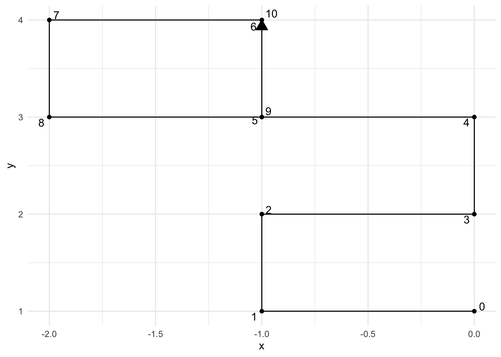
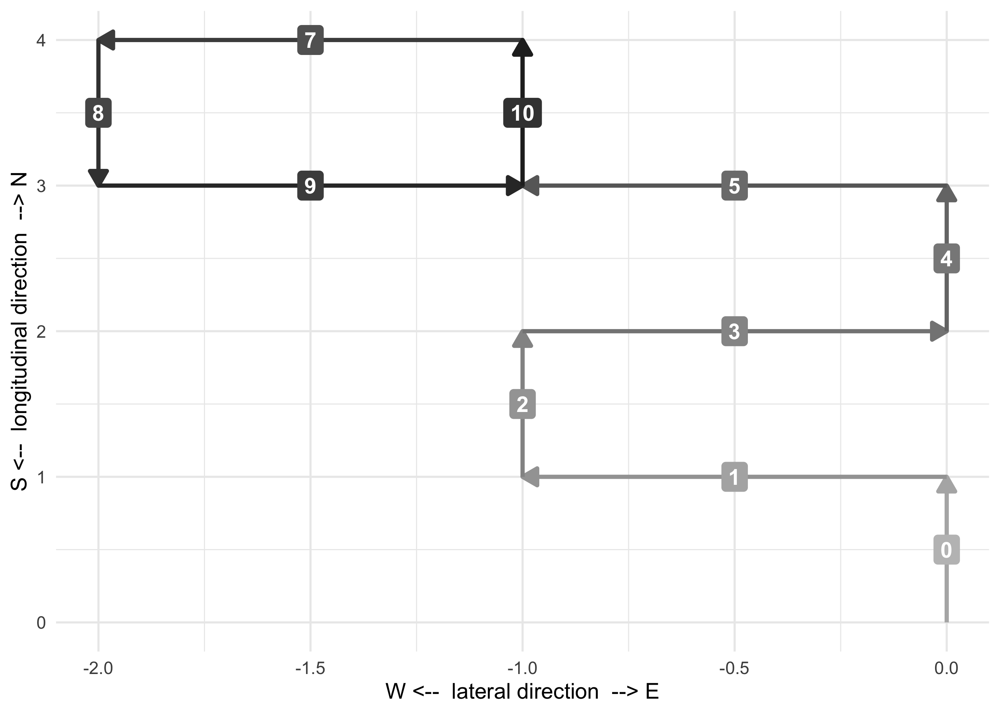
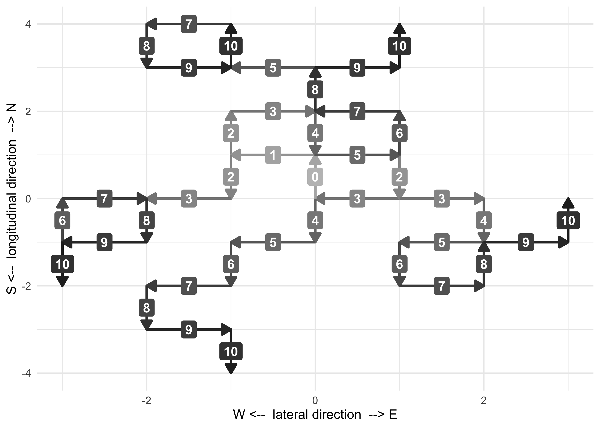
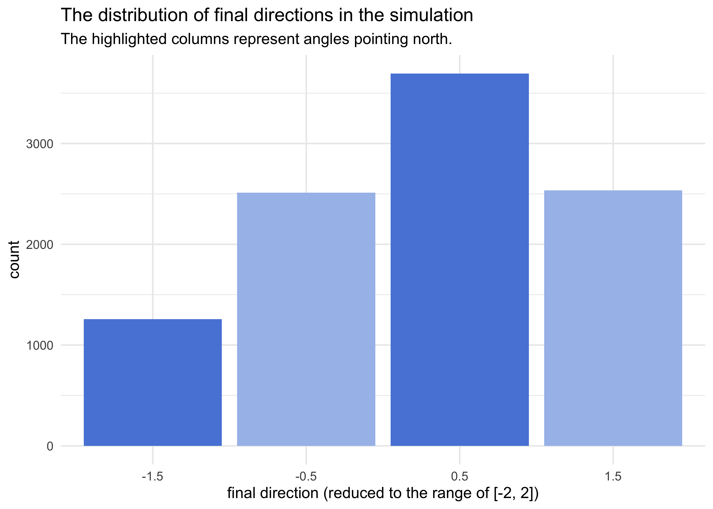
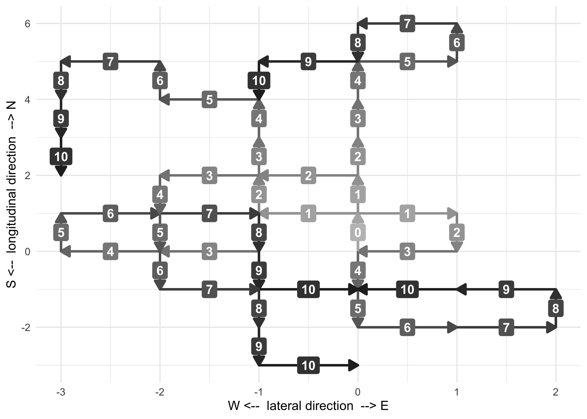
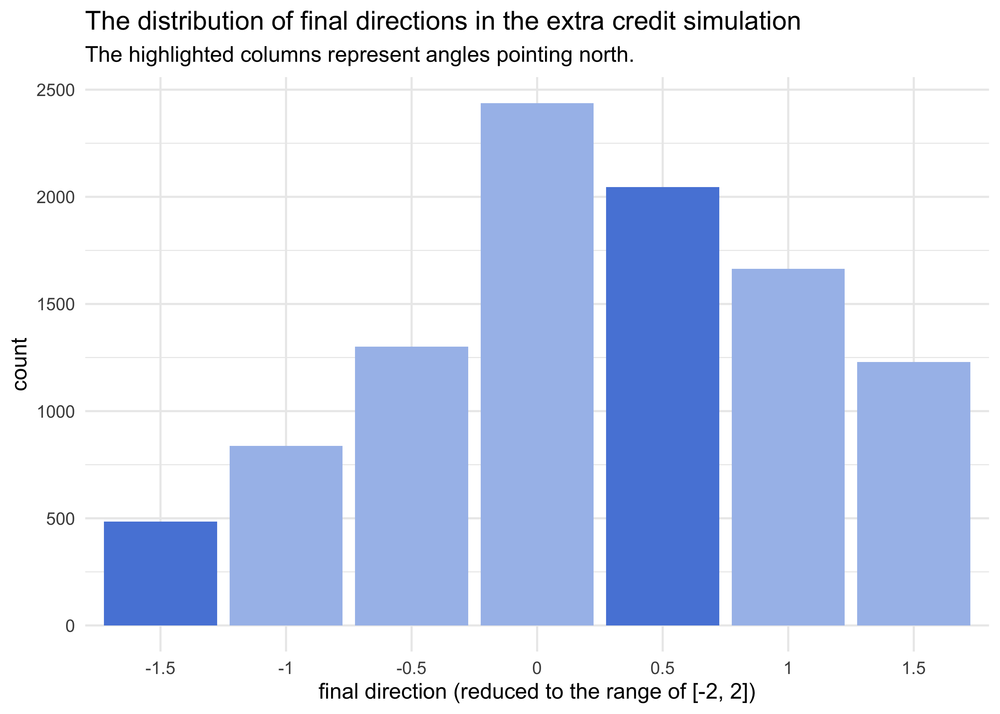

Riddler: Can You Just Keep Turning?
================
Joshua Cook
6/27/2020

*<span style="color:#e36f6f">The following article has been updated to
fix an error identified by several readers. Thank you for your
help\!</span>*

## FiveThirtyEight’s Riddler Express

[link](https://fivethirtyeight.com/features/can-you-connect-the-dots/)

> In Riddler City, the city streets follow a grid layout, running
> north-south and east-west. You’re driving north when you decide to
> play a little game. Every time you reach an intersection, you randomly
> turn left or right, each with a 50 percent chance.
> 
> **After driving through 10 intersections, what is the probability that
> you are still driving north?**
> 
> Extra credit: Now suppose that at every intersection, there’s a
> one-third chance you turn left, a one-third chance you turn right and
> a one-third chance you drive straight. After driving through 10
> intersections, now what’s the probability that you are still driving
> north?

## Plan

This puzzle could be solved analytically, but that would require a lot
more thought than just simulating it. I will try to make the algorithm
generalizable to also be able to solve the extra credit problem without
too many changes.

## Setup

``` r
knitr::opts_chunk$set(echo = TRUE, comment = "#>", cache = FALSE, dpi = 400)

library(mustashe)
library(tidyverse)
library(conflicted)

# Handle any namespace conflicts.
conflict_prefer("filter", "dplyr")
conflict_prefer("select", "dplyr")

# Default 'ggplot2' theme.
theme_set(theme_minimal())

# For reproducibility.
set.seed(0)
```

## A single simulation

### The abstraction

The code for the simulation itself is very simple and mainly contained
within two functions, `simulate_one_drive()` that coordinates everything
and `adjust_direction()` that turns the player based on the current
direction and random turn. More on these in a second.

The tricky part for this simulation was choosing an abstraction. My
first few attempts relied on keeping track of the cardinal direction
(i.e. north, south, east, and west), randomly deciding the turn, and
then updating the cardinal direction based on the turn. But this was
annoyingly complicated because the effect of left or right on the
cardinal direction depends on the direction, itself. Therefore, it
looked like I would need to write a massive (read “error-prone”) if-else
statement.

After quite a bit of thought and diagramming, I realized I could use
angles to solve the problem. If I set north as \(\frac{\pi}{2}\), then a
left turn would be equivalent to adding \(\frac{\pi}{2}\) and turning
right would be equivalent to subtracting \(\frac{\pi}{2}\). And this
would be true regardless of the current direction\!

</img>

Using this approach, I decided to just keep track of the angle of the
current direction and ignore actually traveling through the city. I
could just calculate this afterwards, if needed.

### The main process

Finally, we can get to the code. The `simulate_one_drive()` function
takes probabilities for turning left (`l`), right (`r`), or continuing
straight (`s`) and an argument for the number of steps in the simulation
(`n_steps`).

Right away, the starting direction is defined as \(\frac{1}{2}\). I left
out \(\pi\) from the simulation because I never actually need radians,
just a relative unit for the angle. Therefore, instead of ranging from 0
to \(2\pi\), the “angle” ranges from 0 to 2. Multiplying by \(\pi\)
later can return the radians.

Before the for-loop, there is a quick check to make sure the
probabilities sum to 1.

Finally, the tracker is instantiated as a data frame with the
interaction, current direction, and the choice of turn (“S” for straight
to begin with).

In each step of the for-loop

1.  a turn is randomly chosen according to their predetermined
    likelihoods,
2.  the direction is changed according to the result of the random
    selection using the `adjust_direction()` function (more in a
    second),
3.  the tracker is updated with the current step.

The tracker is returned as the result of the simulation.

``` r
# Simulate one drive.
simulate_one_drive <- function(l, r, s, n_steps = 10) {
    # Start facing "North".
    dir <- 1/2
    
    # Check that the total probability of turning choices is 1.
    stopifnot(sum(c(l, r, s)) == 1)
    
    # Start the tracker.
    tracker <- update_tracker(tibble(), 0, dir, "S")
    
    # Take `n_steps` for the simulation.
    for (i in seq(1, n_steps)) {
        next_turn <- sample(c("L", "R", "S"), 1, prob = c(l, r, s))
        dir <- adjust_direction(dir, next_turn)
        tracker <- update_tracker(tracker, i, dir, next_turn)
    }
    
    return(tracker)
}
```

The update tracker function is just a convenience function for adding
rows to a data frame of the current state of the simulation at each
step.

``` r
# Update the tracker data frame.
update_tracker <- function(tracker, i, dir, turn) {
    bind_rows(
        tracker,
        tibble(i = i, direction = dir, turn = turn)
    )
}
```

The `adjust_direction()` function takes a current direction (`curr_dir`)
and which way to turn (`turn`). It then adds \(\frac{1}{2}\) to turn
left (`"L"`) or subtracts \(\frac{1}{2}\) to turn right (`"R"`). The
original direction is returned to continue straight (`"S"`).

*Note that the reason this function is so simple is not because I did
anything clever with the code, but instead it’s because the abstraction
is so natural to the problem.*

``` r
# Adjust the current direction `curr_dir` based off of the `turn`.
adjust_direction <- function(curr_dir, turn) {
    new_dir <- curr_dir
    if (turn == "L") {
        new_dir <- curr_dir + 0.5
    } else if (turn == "R") {
        new_dir <- curr_dir - 0.5
    } else if (turn == "S") {
        new_dir <- curr_dir
    } else {
        stop(paste0("The change in direction '", turn, "' is not recognized."))
    }
    return(new_dir)
}
```

### An example simulation

Below I run a single example simulation and receive back the tracker.

``` r
set.seed(0)
example_sim <- simulate_one_drive(0.5, 0.5, 0, n_steps = 10)
example_sim
```

    #> # A tibble: 11 x 3
    #>        i direction turn 
    #>    <dbl>     <dbl> <chr>
    #>  1     0       0.5 S    
    #>  2     1       1   L    
    #>  3     2       0.5 R    
    #>  4     3       0   R    
    #>  5     4       0.5 L    
    #>  6     5       1   L    
    #>  7     6       0.5 R    
    #>  8     7       1   L    
    #>  9     8       1.5 L    
    #> 10     9       2   L    
    #> 11    10       2.5 L

From the `direction` column, we can calculate the change in \(x\) and
\(y\) by converting from polar coordinates \((r, \theta)\) to cartesian
coordinates \((x,y)\):

\(x = r \times \cos(\theta)\)  
\(y = r \times \sin(\theta)\)

``` r
example_sim2 <- example_sim %>%
    mutate(dx = round(1 * cos(direction * pi)),
           dy = round(1 * sin(direction * pi)))
example_sim2
```

    #> # A tibble: 11 x 5
    #>        i direction turn     dx    dy
    #>    <dbl>     <dbl> <chr> <dbl> <dbl>
    #>  1     0       0.5 S         0     1
    #>  2     1       1   L        -1     0
    #>  3     2       0.5 R         0     1
    #>  4     3       0   R         1     0
    #>  5     4       0.5 L         0     1
    #>  6     5       1   L        -1     0
    #>  7     6       0.5 R         0     1
    #>  8     7       1   L        -1     0
    #>  9     8       1.5 L         0    -1
    #> 10     9       2   L         1     0
    #> 11    10       2.5 L         0     1

With the change in \(x\) and \(y\) after each turn in the simulation,
the actual position of the car on the grid can be calculated. This is
accomplished by using the
[`accumulate2()`](https://purrr.tidyverse.org/reference/accumulate.html)
function from the [‘purrr’](https://purrr.tidyverse.org/index.html)
package.

``` r
calculate_position <- function(pos, dx, dy) {
    new_pos <- pos
    new_pos$x <- pos$x + dx
    new_pos$y <- pos$y + dy
    return(new_pos)
}

example_sim3 <- example_sim2 %>%
    mutate(pos = accumulate2(dx, dy, 
                             calculate_position, 
                             .init = list(x = 0, y = 0))[-1],
           x = map_dbl(pos, ~ .x$x),
           y = map_dbl(pos, ~ .x$y))
```

Finally, to have a more satisfying visualization of the simulation, we
can plot the \(x\) and \(y\) positions for each turn.

``` r
example_sim3 %>%
    ggplot(aes(x, y)) +
    geom_path(group = "a", 
              arrow = arrow(length = unit(4, "mm"), ends = "last", type = "closed")) +
    geom_point() +
    ggrepel::geom_text_repel(aes(label = i))
```

<!-- -->

To facilitate further analysis of the results of simulations, I packaged
the above steps into a single function
`simulation_results_to_cartesian_positions()`.

``` r
calculate_position <- function(pos, dx, dy) {
    new_pos <- pos
    new_pos$x <- pos$x + dx
    new_pos$y <- pos$y + dy
    return(new_pos)
}

simulation_results_to_cartesian_positions <- function(df) {
    df %>%
        mutate(dx = round(1 * cos(direction * pi)),
               dy = round(1 * sin(direction * pi)),
               pos = accumulate2(dx, dy, 
                                 calculate_position, 
                                 .init = list(x = 0, y = 0))[-1],
               x = map_dbl(pos, ~ .x$x),
               y = map_dbl(pos, ~ .x$y))
}

simulation_results_to_cartesian_positions(example_sim)
```

    #> # A tibble: 11 x 8
    #>        i direction turn     dx    dy pos                  x     y
    #>    <dbl>     <dbl> <chr> <dbl> <dbl> <list>           <dbl> <dbl>
    #>  1     0       0.5 S         0     1 <named list [2]>     0     1
    #>  2     1       1   L        -1     0 <named list [2]>    -1     1
    #>  3     2       0.5 R         0     1 <named list [2]>    -1     2
    #>  4     3       0   R         1     0 <named list [2]>     0     2
    #>  5     4       0.5 L         0     1 <named list [2]>     0     3
    #>  6     5       1   L        -1     0 <named list [2]>    -1     3
    #>  7     6       0.5 R         0     1 <named list [2]>    -1     4
    #>  8     7       1   L        -1     0 <named list [2]>    -2     4
    #>  9     8       1.5 L         0    -1 <named list [2]>    -2     3
    #> 10     9       2   L         1     0 <named list [2]>    -1     3
    #> 11    10       2.5 L         0     1 <named list [2]>    -1     4

I also made a more expressive plotting function `plot_simulation()` that
shows the direction at each step.

``` r
plot_simulation <- function(df) {
    df %>%
        group_by(sim) %>%
        mutate(x_start = dplyr::lag(x, default = 0),
               y_start = dplyr::lag(y, default = 0)) %>%
        ungroup() %>%
        ggplot() +
        geom_segment(aes(x = x_start, y = y_start, xend = x, yend = y,
                         color = i, group = sim),
                     arrow = arrow(length = unit(3, "mm"), type = "closed"),
                     alpha = 1.0, size = 1) +
        geom_label(aes((x_start + x) / 2, (y_start + y) / 2, label = i, fill = i),
                   color = "white", label.size = 0, fontface = "bold") +
        scale_color_gradient(low = "grey70", high = "grey15", guide = FALSE) +
        scale_fill_gradient(low = "grey75", high = "grey25", guide = FALSE) +
        labs(x = "W <--  lateral direction  --> E",
             y = "S <--  longitudinal direction  --> N")
}

example_sim %>%
    simulation_results_to_cartesian_positions() %>%
    mutate(sim = 1) %>%
    plot_simulation()
```

<!-- -->

## The simulation

Finally, we can run a bunch of simulations and answeer the original
question:

> After driving through 10 intersections, what is the probability that
> you are still driving north?

First, lets plot the results of 5 simulations to ensure that the
simulation is working as expected over multiple runs.

``` r
set.seed(0)
tibble(sim = 1:5) %>%
    mutate(res = map(sim, ~ simulate_one_drive(0.5, 0.5, 0, n_steps = 10)),
           res = map(res, simulation_results_to_cartesian_positions)) %>%
    unnest(res) %>%
    plot_simulation()
```

<!-- -->

With that check done, we are ready to run a few thousand simulations.

``` r
set.seed(0)
N_sims <- 1e4

stash("simulation_results", depends_on = "N_sims", {
    simulation_results <- tibble(sim = 1:N_sims) %>%
        mutate(res = map(
            sim, ~ simulate_one_drive(0.5, 0.5, 0, n_steps = 10))
        )
})
```

    #> Loading stashed object.

``` r
simulation_results
```

    #> # A tibble: 10,000 x 2
    #>      sim res              
    #>    <int> <list>           
    #>  1     1 <tibble [11 × 3]>
    #>  2     2 <tibble [11 × 3]>
    #>  3     3 <tibble [11 × 3]>
    #>  4     4 <tibble [11 × 3]>
    #>  5     5 <tibble [11 × 3]>
    #>  6     6 <tibble [11 × 3]>
    #>  7     7 <tibble [11 × 3]>
    #>  8     8 <tibble [11 × 3]>
    #>  9     9 <tibble [11 × 3]>
    #> 10    10 <tibble [11 × 3]>
    #> # … with 9,990 more rows

Now we have a long data frame with nested data frames, each one
representing the results of a single simulation. We now want to tell if
the final direction was pointing north. However, there is one subtle
problem: \(\frac{\pi}{2} = \frac{5\pi}{2} = \frac{9\pi}{2} = ...\).
There are many (infinite) possible angles that all point north.
Therefore, I wrote the `reduce_angle()` function to reduce any angle to
lie within 0 and 2 (because we removed the constant \(\pi\) from the
angle of direction).

``` r
# Reduce the angle from an value to between 0 and 2.
reduce_angle <- function(theta) {
    theta - (2 * trunc(theta / 2))
}
```

Now, we can unnest the simulation results, take the last direction, and
see if it is pointing north.

``` r
simulation_results <- simulation_results %>%
    unnest(res) %>%
    filter(i == 10) %>%
    mutate(reduced_direction = reduce_angle(direction))

prob_north <- sum(simulation_results$reduced_direction %in% c(0.5, -1.5)) / N_sims
```

**The probability of still facing north after randomly turning left and
right at each intersection is 0.495.**

``` r
is_north_pal <- c("TRUE" = "#5887db", "FALSE" = "#a7bfeb")

simulation_results %>%
    count(reduced_direction) %>%
    mutate(is_north = reduced_direction %in% c(0.5, -1.5)) %>%
    ggplot(aes(x = factor(reduced_direction), y = n)) +
    geom_col(aes(fill = is_north)) +
    scale_fill_manual(values = is_north_pal, guide = FALSE) +
    labs(x = "final direction (reduced to the range of [-2, 2])",
         y = "count",
         title = "The distribution of final directions in the simulation",
         subtitle = "The highlighted columns represent angles pointing north.")
```

<!-- -->

## Extra credit

Since I allowed for a probability of going straight in the
`simulate_one_drive()` function, solving the extra credit problem
requires no change to the code other than a single argument value.

> Extra credit: Now suppose that at every intersection, there’s a
> one-third chance you turn left, a one-third chance you turn right and
> a one-third chance you drive straight. After driving through 10
> intersections, now what’s the probability that you are still driving
> north?

``` r
set.seed(0)
tibble(sim = 1:5) %>%
    mutate(res = map(sim, ~ simulate_one_drive(1/3, 1/3, 1/3, n_steps = 10)),
           res = map(res, simulation_results_to_cartesian_positions)) %>%
    unnest(res) %>%
    plot_simulation()
```

<!-- -->

``` r
set.seed(0)

stash("simulation_results_ec", depends_on = "N_sims", {
    simulation_results_ec <- tibble(sim = 1:N_sims) %>%
        mutate(res = map(
            sim, ~ simulate_one_drive(1/3, 1/3, 1/3, n_steps = 10))
        ) %>%
        unnest(res) %>%
        filter(i == 10) %>%
        mutate(reduced_direction = reduce_angle(direction))
})
```

    #> Loading stashed object.

``` r
prob_north <- sum(simulation_results_ec$reduced_direction %in% c(0.5, -1.5)) / N_sims
```

**The probability of still facing north after randomly turning left,
right, or continuing straight at each intersection is 0.253.**

``` r
simulation_results_ec %>%
    count(reduced_direction) %>%
    mutate(is_north = reduced_direction %in% c(0.5, -1.5)) %>%
    ggplot(aes(x = factor(reduced_direction), y = n)) +
    geom_col(aes(fill = is_north)) +
    scale_fill_manual(values = is_north_pal, guide = FALSE) +
    labs(x = "final direction (reduced to the range of [-2, 2])",
         y = "count",
         title = "The distribution of final directions in the extra credit simulation",
         subtitle = "The highlighted columns represent angles pointing north.")
```

<!-- -->
